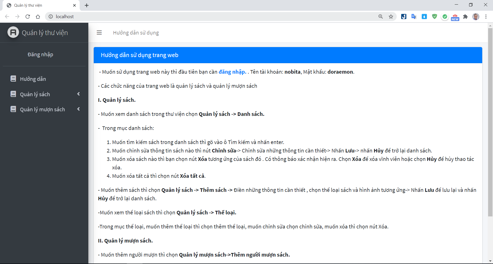

## Mục lục:
1.[Hướng dẫn cài đặt](#p1)

2.[Các chức năng chính của chương trình](#p2)

3.[Cấu trúc thư mục chương trình](#p3)

4.[Tài liệu tham khảo](#p4)

<a id="p1"></a> 
# Hướng dẫn cài đặt:

1. Cài đặt Java : [Java JDK 13](https://www.oracle.com/java/technologies/javase-jdk13-downloads.html)

2. Download database: [here](Database/manage_library.sql) hoặc truy cập [thư mục](Database)

3. Cài đặt môi trường lập trình
 - [Eclipse](https://www.eclipse.org/downloads/)
 - [Apache Tomcat® - Apache Tomcat 8.5.59](https://tomcat.apache.org/download-80.cgi)

4. Khởi chạy chương trình:
	- Run với server tomcat phiên bản 8.5.59
5. Truy cập trang chủ: Làm theo hướng dẫn sử dụng
6. Tài khoản đăng nhập trang admin:  Tai khoan đăng nhập: [nobita],password: [doraemon]

<a id="p2"></a> 
# Các chức năng chính của chương trình.
Được đặc tả qua tài liệu Usecase tổng quát:
<div align='center'>
  
</div>

- Giao diện chính:
+ Hướng dẫn sử dụng

+ Đăng nhập

+ Thêm

+ Sửa

+ Xóa

+ Tìm kiếm


<a id="p3"></a> 
# Cấu trúc thư mục
```
$ Cấu trúc thư mục
.
├── Database
│   ├── manage_library.sql
├── Document
│   ├── BaoCaoCKLTM.doc
├── images
│   ├── .........
├── Source Code
│   ├── QuanLyThuVien
│   	└── src (Chứa các file servlet)
│   	└── WebContent (Chứa các file JSP/Css/Javascrip/Bootstrap)
└── README.md

```

<a id="p4"></a> 
# Tài liệu tham khảo
 1. Template : [https://adminlte.io//](https://adminlte.io/)
 2. Báo cáo : (Document/BaoCaoCKLTM.doc)
